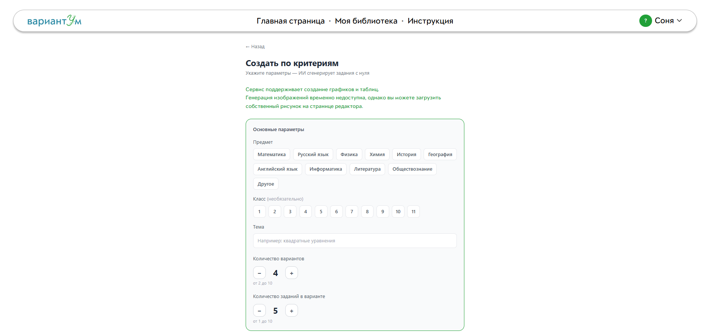
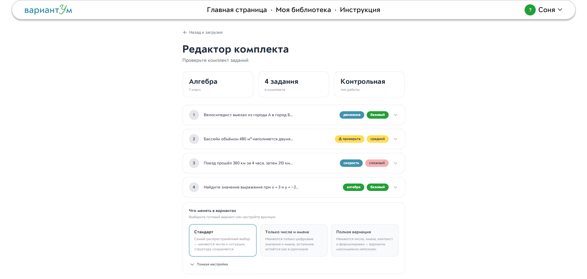
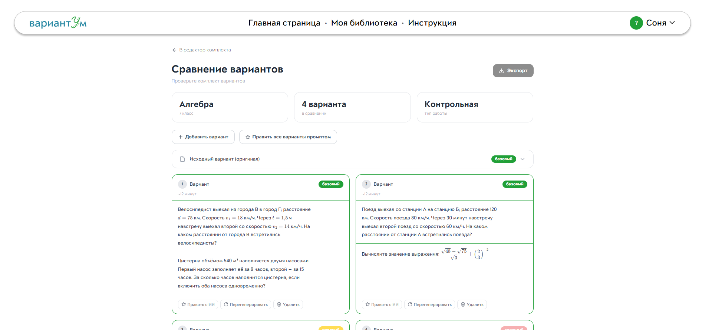
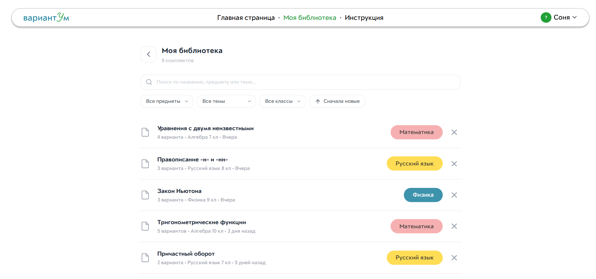
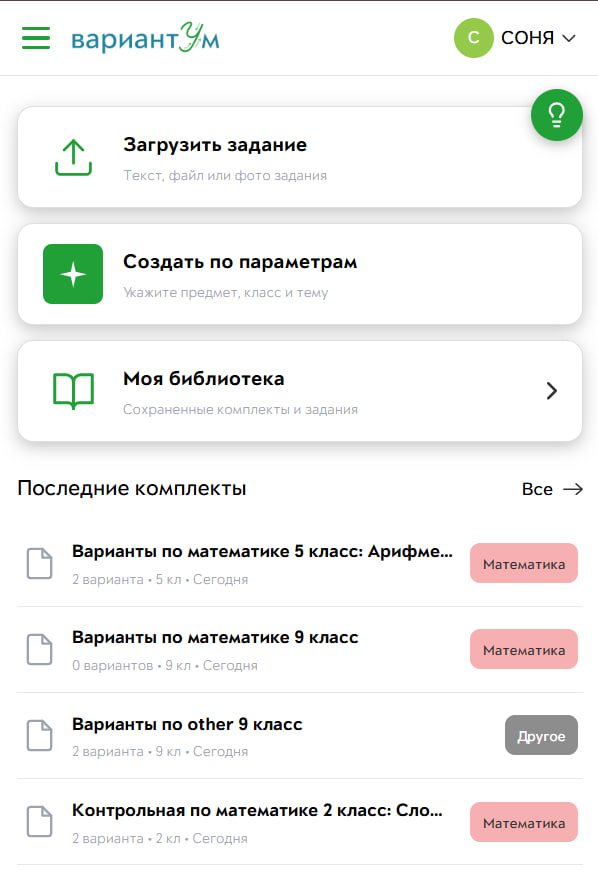
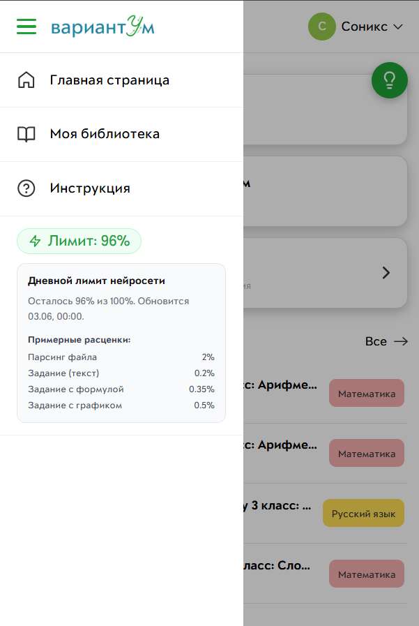

# ВариантУм 📚
🥉 **3 место** · Хакатон СберОбразование × Школа 21 «ИИ для образования: автоматизация рутинных задач»

> ИИ-сервис, который из одного школьного задания делает десяток **равносложных** вариантов — за минуты вместо часа ручной работы.

*Один пример — десять вариантов. Один промпт — целая контрольная.*


[](https://openjdk.org/)
[](https://spring.io/projects/spring-boot)
[](https://react.dev/)
[](https://www.typescriptlang.org/)
[](https://developers.sber.ru/portal/products/gigachat)
[](https://www.postgresql.org/)
[](https://www.docker.com/)

### 🌐 Живое демо — [http://186.246.10.228](http://186.246.10.228)

Доступно на десктопе и мобильном, попробовать можно без установки.

## Проблема

Чтобы честно оценить класс, учителю мало одной контрольной — нужно несколько вариантов, одинаковых по сложности, но разных по содержанию. Вручную это **от 40 минут до 2 часов** на одну работу. И почти половина аудитории — педагоги 45+, которым тяжело с перегруженными инструментами и ИИ-чатами.

Обычный LLM-чат здесь не помогает: он генерирует текст, но не решает **методическую** задачу — не гарантирует равную сложность вариантов, не понимает структуру реального задания из учебника и не отдаёт готовый файл, который можно сразу распечатать.

## Решение

**ВариантУм** закрывает именно эту задачу — от загрузки эталона до готового PDF с вариантами и отдельным листом ответов для учителя. Сервис сохраняет дидактическую цель и одинаковую сложность, распознаёт реальные школьные материалы (PDF / DOCX / фото) и держит данные каждого учителя изолированно.

**Два способа создать комплект:**

- **По эталону** — загрузить готовое задание (текст, PDF, DOCX или фото со страницы учебника). Сервис разбирает структуру, отделяет «скелет» задания от переменных частей и размножает его в N вариантов того же типа и уровня.
- **По критериям** — эталона нет: задать предмет, класс, тему, тип, число вариантов, время и сложность, и комплект соберётся с нуля.

## 📸 Скриншоты

| Генерация по параметрам | Редактор варианта |
|---|---|
|  |  |
| **Сравнение вариантов** | **Библиотека комплектов** |
|  |  |

### Мобильная версия

<p align="center">
  
  &nbsp;&nbsp;
  
</p>

## Возможности

- **Промпт-пожелание на любом шаге** — «задачи про космос», «без дробей», «сделай полегче»; учитывается при генерации и правке.
- **Гибкая сложность** — варианты одинаковые, с нарастающей сложностью или произвольные.
- **Три способа правки** — вручную в WYSIWYG-редакторе с формулами (KaTeX / MathLive), промптом к одному варианту или ко всему комплекту сразу.
- **Сравнение вариантов** — все варианты рядом с подсветкой различий; можно перегенерировать или добавить ещё.
- **Распознавание фото и формул** через GigaChat Vision, с офлайн-фолбэком на Tesseract OCR.
- **Экспорт в PDF и DOCX** — с полями ФИО / класс / дата и отдельным комплектом ответов для учителя; формулы и графики рендерятся в SVG.
- **Онлайн-форма для учеников** — учитель отправляет ссылку, ученик решает и присылает ответы, учитель проверяет и ставит оценку прямо на платформе.
- **Личная библиотека** — все комплекты в одном месте, с поиском и историей версий (снимки в БД).
- **Онбординг для педагогов** — интерактивный тур запускается с любой страницы; адаптирован для учителей старшего возраста.

## Стек

| Слой | Технологии |
|---|---|
| **Backend** | Java 21, Spring Boot 3.2 (Web, WebFlux, Security/JWT, Data JPA, Data Redis) |
| **Frontend** | React 18 + TypeScript, Vite, TanStack Query, Zustand, Tailwind CSS, Radix UI, Tiptap, KaTeX, MathLive |
| **БД и хранилище** | PostgreSQL 16 + Flyway, Redis 7, MinIO (S3-совместимое) |
| **LLM** | GigaChat API (мультимодель: `GigaChat` Lite + `GigaChat-2-Pro`), авто-фолбэк 402 → Lite |
| **Парсинг** | Apache PDFBox, Apache POI, Tess4J (Tesseract OCR, русская модель) |
| **Экспорт** | iText 7 (PDF), docx4j (DOCX), SVG-рендеринг формул и графиков |
| **Инфраструктура** | Docker + docker-compose, Nginx (reverse proxy + статика) |

## Архитектура

```
Browser
   │
   ▼
Nginx (80)
   ├── /          → React SPA (статика)
   └── /api       → Spring Boot (8080)
                       ├── AuthController      JWT + refresh-токены
                       ├── ProjectController   проекты / комплекты
                       ├── VariantController   варианты, AI-правка
                       ├── AnalyzeController   анализ эталона (GigaChat)
                       ├── ExportController    PDF / DOCX
                       ├── FormController       онлайн-форма для учеников
                       ├── FileController       загрузка файлов → MinIO
                       └── LimitsController     лимиты на генерацию
                                │
                    ┌───────────┼───────────┐
                    ▼           ▼           ▼
               PostgreSQL     Redis       MinIO
               (данные)     (кэш/сессии) (файлы)
                                │
                                ▼
                          GigaChat API
                       (Lite / Pro)
```

## Быстрый старт

**Требуется:** Docker + docker compose (для полного стека). Для разработки без Docker — JDK 21 и Node.js 20+. И **ключ GigaChat** (Client ID + Client Secret) из [GigaChat Studio](https://developers.sber.ru/studio/workspaces/).

### Шаг 1. Переменные окружения

```bash
cp .env.example .env
```

Обязательные значения в `.env`:

| Переменная | Назначение |
|---|---|
| `GIGACHAT_CLIENT_ID` | UUID клиента из GigaChat Studio |
| `GIGACHAT_CLIENT_SECRET` | секрет клиента (UUID, **не** base64-строка) |
| `JWT_SECRET` | длинная случайная строка — `openssl rand -base64 64` |
| `DB_PASSWORD` | пароль PostgreSQL |
| `MINIO_SECRET_KEY` | секрет MinIO |

> ⚠️ **Про модели.** Бесплатная (Lite) модель называется именно `GigaChat` — `GIGACHAT_MODEL_LITE=GigaChat`. Имени `GigaChat-2-Lite` не существует (API вернёт 404). Основная модель — `GIGACHAT_MODEL=GigaChat-2-Pro`.

### Шаг 2а. Полный стек одной командой

```bash
docker compose up --build -d
```

После старта:

- **Frontend** — http://localhost
- **Backend API** — http://localhost/api
- **Swagger UI** — http://localhost/api/swagger-ui.html
- **MinIO Console** — http://localhost:9001

### Шаг 2б. Режим разработки

```bash
# только инфраструктура
docker compose up -d postgres redis minio

# backend → http://localhost:8080/api
cd backend
./mvnw spring-boot:run          # Windows: mvnw.cmd spring-boot:run

# в отдельном терминале — frontend → http://localhost:5173
cd frontend
npm install && npm run dev
```

Миграции БД (Flyway) применяются автоматически при старте backend, бакет MinIO создаётся сервисом `minio-init`.

### Проверка

```bash
curl http://localhost:8080/api/health   # → 200 OK
```

Затем откройте фронтенд, зарегистрируйтесь (email + пароль ≥ 8 символов), выберите режим и сгенерируйте первый комплект.

### Остановка

```bash
docker compose down          # остановить
docker compose down -v       # остановить и удалить тома (данные пропадут)
```

## Структура репозитория

```
variantum/
├── backend/            Spring Boot (Maven, Java 21)
│   └── src/main/java/ru/variantum/
│       ├── controller/  REST-контроллеры
│       ├── service/     бизнес-логика (llm/, auth/, export/)
│       ├── domain/      JPA-сущности
│       └── config/      Security, GigaChat, MinIO
├── frontend/           React + Vite + TypeScript
│   └── src/
│       ├── pages/       экраны приложения
│       ├── features/    редактор, экспорт
│       ├── tour/        интерактивный онбординг
│       └── api/         клиентский слой
├── docs/               проектная документация + материалы
├── docker-compose.yml  postgres + redis + minio + backend + frontend + nginx
├── .env.example        пример переменных окружения
└── README.md
```

## Моя роль

Чибисова Софья — full-stack разработка: бэкенд (Java, Spring Boot) и фронтенд (React / TypeScript), доменная модель и логика генерации вариантов, промпт-инжиниринг и интеграция с GigaChat API, UI/UX-дизайн интерфейса, деплой демо-версии.

## Команда

| | Имя | Роль |
|---|---|---|
| 👩‍💻 | **Соня** | Backend (Java/Spring), Frontend (React/TS), UI/UX-дизайн, Prompt Engineering |
| 👩‍💻 | **Кристина** | Backend (Java/Spring), Frontend (React/TS), БД, Prompt Engineering |

## 🏆 Награды

🥉 **3 место** · Хакатон СберОбразование × Школа 21 «ИИ для образования: автоматизация рутинных задач»

📄 [Диплом и материалы проекта (Google Drive)](https://drive.google.com/drive/folders/1LxodVZjR-Sg7DwvFsQNQ4GKtU6LR_1f-?usp=sharing)
